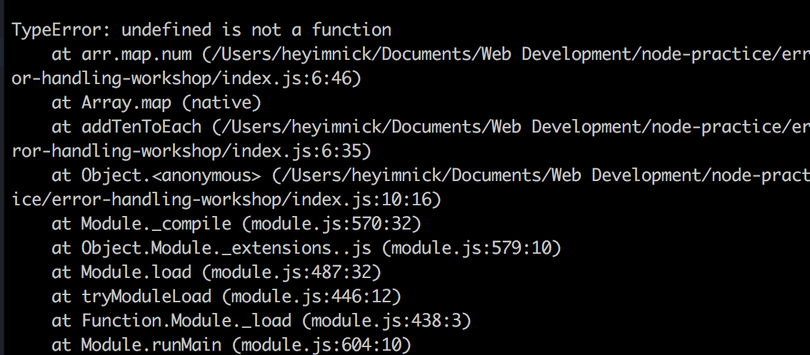

# Error Handling Workshop
**Author**: [@njsfield](https://github.com/njsfield)

**Maintainer**: [@eliascodes](https://github.com/eliascodes)

Inspired by [@rjmk](https://github.com/rjmk) and his [error handling talk](https://github.com/rjmk/fac-error-talk)




## Intro

> "whatever can go wrong, will go wrong." - Capt. Edward A. Murphy, 1949

Before 1949, the saying had actually been around for years. Murphy gave it a name when working on Air Force Project MX981, a project designed to see how much sudden deceleration a person can stand in a crash. The "law" was used successfully in the project to assert good safety measures, by way of focussing on circumventing errors.

## Learning Outcomes
* Understand the need to handle errors and why poor error handling can be dangerous
* Understand how to `throw` an error
* Understand how to use `try/catch` to handle thrown errors
* Understand how to use the return error pattern
* Understand how to use the error-first callback pattern
* Understand in what contexts each of these approaches might be useful
* Understand why server-side validation is necessary for safe software

## Problem

JavaScript is a dynamically typed language. You can call a function with any types of arguments passed to it, and the function will try to execute;

```javascript
const changeVal = (func, val) => func(val)

console.log(changeVal({}, 6))

// TypeError: func is not a function
```
... and could fail and break your application.  This example seems trivial, but can easily happen (perhaps by forgetting to pass all arguments into a function, or passing them in the wrong order).

Sometimes errors happen silently, causing problems down the line that are hard to trace:

```javascript
const addTen = (num) => num + 10

const addTenToEach = (arr) => arr.map(addTen)

const arrayOfNumbersIThink = [0, 2, {number: 6}, 8]

const result = addTenToEach(arrayOfNumbersIThink)

console.log(result);
// [ 10, 12, '[object Object]10', 18 ]

nextOperation(result)
// ... danger
```
Here our `addTen` function has unknowingly worked with two different data types: a `Number` and an `Object`. When asked to add a number to an object, our lovely JavaScript engine coerces them both to strings and concatenates them together to produce `'[object Object]10'`, which is not helpful.

If `arrayOfNumbersIThink` was retrieved from an **API call** or **user input**, we can't always be certain the values will be what we expect. How can we deal with these situations?

## Kinds Of Errors
Broadly speaking, errors come in two kinds [[8]](#resources):
* **Programmer errors**: These are _bugs_; they are unintended and/or unanticipated behaviour of the code, and they can only be fixed by changing the code (e.g. calling a function with the wrong number of arguments)
* **Operational errors**: These are runtime errors that are usually caused by some external factor (e.g. any kind of network error, failure to read a file, running out of memory, etc.)

How you should handle any given error depends on what kind of error it is. Operational errors are a normal part of the issues a program must deal with. They typically should not cause the program to terminate or behave unexpectedly. By contrast, programmer errors are by definition unanticipated, and may potentially leave the application with unpredictable state and behaviour. In this case it is usually best to terminate the program.

There is, however, no blanket rule for what to do; each error represents a specific problem in the context of an entire application and the appropriate response to it will be heavily context dependent.

## Approaches
Good error handling is typically not something that can just be bolted onto an existing program as an afterthought. Well conceived error handling will affect the structure of the code. In JavaScript and Node.js, there are a number of approaches, some of which are explored below.

### General Principles
Regardless of the chosen approach, there are some principles which can be generally applied:
1. **Be consistent, not ad-hoc.**
  * Inconsistent approaches to error handling will complicate your code and make it much harder to reason about.
2. **Try to trip into a failure code path as early as possible.**
  * A _code path_ is the path that data takes through your code. A _success code path_ is the path data takes if everything goes right. A _failure code path_ is the path data takes if something goes wrong.
  * For example, it may be tempting to return default values in the case of an error and allow the application to continue as normal.
  * This may be appropriate in some cases, but can often cover up the root cause of an error and make it difficult to track down, or result in unhelpful error messages.
3. **Propagate errors to a part of the application that has sufficient context to know how to deal with them.**
  * Many times, we will write generic functions to perform common actions, like making a network request.
  * If the network request fails, the generic function cannot infer the appropriate response, because it doesn't know which part of the application it has been called from.
  * It should therefore try to propagate the error to its caller instead of trying to recover directly.

### Illustrative Example
To illustrate the three approaches we will cover, we will use the same simple example in each, so that comparisons are easier. Imagine you intend to write a function `applyToInteger`, with the following signature:
```js
applyToInteger(func, integer)
```
That is, the function accepts two arguments, `func`, which is a `Function`, and `integer` which is a whole `Number`. It applies the `func` to `integer` and returns the result. We will use this example to explore how to deal with unexpected inputs.

### Approach 1: Throwing and Catching Errors

#### Throwing
During runtime, errors can be thrown in our application unexpectedly by computations acting on faulty computations produced earlier (like the first example above). We can also manually throw errors ourselves by using the [`throw`](https://developer.mozilla.org/en-US/docs/Web/JavaScript/Reference/Statements/throw) keyword. This will immediately terminate the application, unless there is a [`catch`](https://developer.mozilla.org/en-US/docs/Web/JavaScript/Reference/Statements/try...catch) block in the call stack.

#### Catching
Errors that have been thrown can be caught using a [`try...catch`](https://developer.mozilla.org/en-US/docs/Web/JavaScript/Reference/Statements/try...catch) block. The `catch` block will catch all errors that arise in the `try` block, even if they are programmer errors. Ideally there would be sufficient logic in the `catch` block to differentiate these cases so that we are not at risk of recovering from a programmer error.

#### Example
```js
const applyToInteger = (func, integer) => {
  if (typeof func !== 'function') {
    throw new TypeError('Invalid argument: First argument is not a function');
  }

  if (! Number.isInteger(integer)) {
    throw new TypeError(`Invalid argument: Second argument ${integer} is not an integer`);
  }

  return func(integer);
};
```

Using this function in the REPL:
```
> applyToInteger((n) => 2 * n, 2)
4

> applyToInteger((n) => `You passed ${n}`, -4)
'You passed -4'

> applyToInteger({}, 2)
TypeError: Invalid argument: First argument is not a function
...

> applyToInteger((n) => n, 2.3)
TypeError: Invalid argument: Second argument 2.3 is not an integer
...
```

If we wish to be able to recover, we can augment this approach by using a `try/catch` block:

```js
const applyAndPrintResult = (func, integer) => {
  try {
    const result = applyToInteger(func, integer);

    console.log('Result successfully calculated:');
    console.log(`Applying ${func.name} to ${integer} gives ${result}`);
  } catch (e) {
    console.log('Sorry, result could not be calculated:');
    console.log(e.message);
  }
}
```

Using this function in the REPL:
```
> applyAndPrintResult(function double (n) { return 2 * n; }, 2)
Result successfully calculated:
Applying double to 2 gives 4

> applyAndPrintResult(function increment (n) { return n + 1; }, -4)
Result successfully calculated:
Applying increment to -4 gives -3

> applyAndPrintResult({}, 2)
Sorry, result could not be calculated:
Invalid argument: First argument is not a function

> applyAndPrintResult((n) => n, 2.3)
Sorry, result could not be calculated:
Invalid argument: Second argument 2.3 is not an integer
```

#### Guidance
While fairly drastic, throwing errors is a useful approach and is appropriate in many cases.
* Throwing can be useful for making critical assertions about the state of your application, especially during startup (e.g. database connection has been established).
* Throwing should **only** be used in synchronous functions, **not** in asynchronous functions. Errors thrown from asynchronous functions will not be caught. To understand why, learn about the javascript [call stack](https://www.youtube.com/watch?v=8aGhZQkoFbQ).
* Remember to use `catch` blocks to avoid inappropriate program termination. (e.g. a server should usually not crash in the course of dealing with a client request).
* Without `catch` blocks codebases that `throw` errors extensively will be very fragile.
* Do not simply log the error in a `catch` block. This can be worse than no error handling at all.
* Note that `catch` will trap errors that are thrown at any point in the call stack generated by the `try` block.

### Approach 2. Returning Errors to the Caller
Rather than throwing the error, another approach you might consider is simply to return it to the caller. Our example looks very similar to the first approach, except that instead of a `try/catch` block, we have an `if/else` that checks the return value using the [`instanceof`](https://developer.mozilla.org/en-US/docs/Web/JavaScript/Reference/Operators/instanceof) operator.

#### Example
```js
const applyToInteger = (func, integer) => {
  if (typeof func !== 'function') {
    return new TypeError('Invalid argument: First argument is not a function');
  }

  if (! Number.isInteger(integer)) {
    return new TypeError(`Invalid argument: Second argument ${integer} is not an integer`);
  }

  return func(integer);
};

const applyAndPrintResult = (func, integer) => {
  const result = applyToInteger(func, integer);

  if (result instanceof Error) {
    console.log('Sorry, result could not be calculated:');
    console.log(result.message);
  } else {
    console.log('Result successfully calculated:');
    console.log(`Applying ${func.name} to ${integer} gives ${result}`);
  }
}
```

Using this function in the REPL:
```
> applyAndPrintResult(function double (n) { return 2 * n; }, 2)
Result successfully calculated:
Applying double to 2 gives 4

> applyAndPrintResult(function increment (n) { return n + 1; }, -4)
Result successfully calculated:
Applying increment to -4 gives -3

> applyAndPrintResult({}, 2)
Sorry, result could not be calculated:
Invalid argument: First argument is not a function

> applyAndPrintResult((n) => n, 2.3)
Sorry, result could not be calculated:
Invalid argument: Second argument 2.3 is not an integer
```

#### Guidance
* Requires more granular error checking throughout the codebase.
  * A single `catch` block can catch errors that are thrown in multiple functions if it is placed high in the call stack (which it usually should). No similar mechanism exists if errors are simply returned.
  * This places a burden on the developer(s). If they forget to place error checks on return values that might be `Error` objects, they are effectively introducing a programmer error that may result in other errors being thrown elsewhere in the application.
* Does not catch programmer errors.
  * This is actually a good thing, in light of [this](#kinds-of-errors) and [[8]](#resources).
* This is a specific example of a more general pattern, namely, returning an object which indicates whether the operation has been successful or not. Alternatives include returning an object with a `success` or `isValid` field.

### Approach 3. Error-First Callbacks
This next approach is a widespread pattern in Node.js that you will already have encountered, for example when using the `fs` module. It is one of the ways that we can deal with errors that are generated during asynchronous processes in Node.js.

We can implement this pattern by requiring a third argument to be passed to `applyToInteger`, which will be a callback function that is executed both in the case where an operational error has occurred, _and_ when the operation completes successfully.

* In the error case, the callback is executed with an `Error` object as its only argument.
* In the success case, the callback is executed with `null` as its first argument and the result as its second argument

#### Example
```js
const applyToInteger = (func, integer, callback) => {
  if (typeof func !== 'function') {
    callback(new TypeError('Invalid argument: First argument is not a function'));
  }
  else if (! Number.isInteger(integer)) {
    callback(new TypeError(`Invalid argument: Second argument ${integer} is not an integer`));
  }
  else {
    callback(null, func(integer));
  }
};

const applyAndPrintResult = (func, integer) => {
  applyToInteger(func, integer, (err, result) => {
    if (err) {
      console.log('Sorry, result could not be calculated:');
      console.log(err.message);
    } else {
      console.log('Result successfully calculated:');
      console.log(`Applying ${func.name} to ${integer} gives ${result}`);
    }
  });
}
```

Using this function in the REPL:
```
> applyAndPrintResult(function double (n) { return 2 * n; }, 2)
Result successfully calculated:
Applying double to 2 gives 4

> applyAndPrintResult(function increment (n) { return n + 1; }, -4)
Result successfully calculated:
Applying increment to -4 gives -3

> applyAndPrintResult({}, 2)
Sorry, result could not be calculated:
Invalid argument: First argument is not a function

> applyAndPrintResult((n) => n, 2.3)
Sorry, result could not be calculated:
Invalid argument: Second argument 2.3 is not an integer
```

#### Guidance
* This is the convention for handling errors when using callbacks for asynchronous control flow in Node. Try not to deviate from this pattern when writing async callback-based code.
* Structurally similar to returning errors in that it requires checks in the calling code.
* Maintain consistent interfaces; if a function requires a callback, do not also `throw` or `return` errors to the caller.

# Exercise: Error Handling & Server-side Validation

## Problem
Error handling is a crucial consideration when something can go wrong, or when some of the data in your application isn't quite as you expect. One of the most common examples of unexpected data posing a risk to your application is when an application has to deal with user input.

We cannot guarantee that a user will enter exactly the kind of data we expect. If we do make that assumption, we are essentially introducing an unhandled operational error into our application.

The way that we can avoid introducing this operational error is with **server-side validation**. This means validating the data that is entering your application, and making sure it is the type of data that we expect to be working with, _before_ we try to use it.


## Specification
As part of an application that serves users wishing to apply to FAC, you're running a server which accepts `POST` requests of a forms content to the path `/submit`. You need to validate the form contents before providing an appropriate response to the user, so you'll need write several functions to use inside of the handler dealing with requests to `/submit`, and write tests for these functions.

##### `POST /submit`
This endpoint accepts the following parameters in the body of the request (also known as the payload):

* `filename`: String, filename with which the application will be saved. 30 characters or fewer. Beware of [directory traversal!](https://www.owasp.org/index.php/Path_Traversal)
* `contents`: Object, with the following attributes...
  * `name`: String, name of the applicant, 30 characters or fewer.
  * `age`: Integer, between 2 and 20.
  * `body`: String, body of the application text, 10000 characters or fewer.

Once the handler has validated the parameters of the request it should call the provided `createRecord` function, which has the following signature:
```js
createRecord(filename, contents, callback)
```
* `filename`: Filename to save to, same definition as above.
* `contents`: Data structure defining the book contents with the same definition as above.
* `callback`: A function with the signature `callback(error, message)`, where `error` is either `null` or a potential `Error` object, `message` contains the response to the client.

After `createRecord` executes its callback, the handler should respond appropriately to the client.

**Note**: `createRecord` is an external library function; you don't need to understand what it does, just how to use it.

**Note**: `createRecord` performs no error checking and assumes all its inputs are correct. Incorrect inputs will have unpredictable consequences.

## Other Requirements
* The server should not crash because of a client request.
* If the client supplies bad data, the server should respond with a `400` (Bad request) status code and a helpful message indicating the problem.

## Files
The only relevant places to look are in `src` and `tests/src`. You have been provided with `src/router.js` and `src/createRecord.js` files. Don't worry about them, focus instead on `src/handler.js` (the handler for the `POST /submit` endpoint), and the files you create for your validation functions.

## Steps
1. Decide how your validation code will indicate that there is a problem with the payload. You are free to use any of the three approaches outlined above (or use another approach if you feel it is appropriate).
2. Start by writing individual functions to validate each aspect of the payload. This will make it easier to adhere to TDD as you write them (which you should). We've started you off with `src/validateFilename.js` and `tests/src/validateFilename.test.js`.
3. After you have written your individual functions, you can move on to completing the handler in `src/handler.js`. This can also be approached using TDD by using the [`shot`](https://github.com/hapijs/shot) module to test your handler. We've started you off again with `src/handler.js` and `tests/src/router.test.js`.
4. After you think you have finished, run the acceptance tests with `npm run acceptance`. If any of them fail, you have missed an edge case. Otherwise, you are done :tada:

### Notes
These notes are important to be aware of in general, but are not necessary for the purposes of the workshop.

#### Error-First Callback Pattern
There are a couple of gotchas when using this callback pattern:
* You _must_ ensure that the callback is not called more than once in your function. This can be done either using `if/else` blocks, `switch` statements (with `break`), or early `return` statements (e.g. `return callback(null, result)`).
* When presenting a callback interface to the caller, it will expect the callback to be executed asynchronously. On Node.js, you can use [`process.nextTick`](https://nodejs.org/api/process.html#process_process_nexttick_callback_args) for this purpose, on the client-side, you can use `setTimeout(Function, 0)`.

### Resources
1. [ES6 Features - Destructuring](http://es6-features.org/#ParameterContextMatching)
2. [The Beginner's Guide to Type Coercion: A Practical Example](https://code.tutsplus.com/articles/the-beginners-guide-to-type-coercion-a-practical-example--cms-21998)
3. [404 Error Pages](https://www.smashingmagazine.com/2009/01/404-error-pages-one-more-time/)
4. [MDN - Error](https://developer.mozilla.org/en-US/docs/Web/JavaScript/Reference/Global_Objects/Error)
5. [MDN - instanceof](https://developer.mozilla.org/en-US/docs/Web/JavaScript/Reference/Operators/instanceof)
6. [Post Requests in Node](http://stackoverflow.com/questions/4295782/how-do-you-extract-post-data-in-node-js)
7. [Shot Documentation](https://github.com/hapijs/shot)
8. [Joyent - Error Handling in Node.js](https://www.joyent.com/node-js/production/design/errors)
9. [Rafe's (@rjmk) Error Handling Talk](https://github.com/rjmk/fac-error-talk)
10. [Proper Error Handling in JavaScript](https://www.sitepoint.com/proper-error-handling-javascript/)
